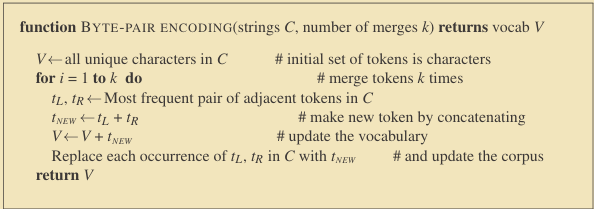

# BPE Byte-Pair-Encoding Algorithm
Custom implementation of the `BPE tokenizer` in python.  
  
The BPE is a simple bottom up tokenizer algorithm [(Sennrich et al., 2016)](https://aclanthology.org/P16-1162.pdf)
The tokenization scheme have two parts:
- **Token learner** the token learner takes a raw training corpus (sometimes roughly pre-separated into word,  for example by whitespace) and induces a vocabulary, a set of tokens.  
- **Token segmenter** the token segmenter takes a raw test sentence and segments it into the tokens in the vocabulary. 

> The BPE token learner begins with a vocabulary that is just the set of all individual characters. It then examines the training corpus, chooses the two symbols that are most frequently adjacent (say ‘A’,‘B’), adds a new merged symbol ‘AB’ to the vocabulary, and replaces every adjacent ’A’ ’B’ in the corpus with the new ‘AB’. It continues to count and merge, creating new longer and longer character strings, until k merges have been done creating k novel tokens; k is thus a parameter of the algorithm. The resulting vocabulary consists of the original set of characters plus k new symbols.  
> *Speech and Language Processing, Dan Jurafsky and James H. Martin*

## Algorithms & DataStructures
Breakdow of the algorithms and the datastructures in the implementation of the tokenizer, althought the code is well documented.
The file `./tokenizer.py` contains the `BPETokenizer` class which is the implementation of the **BPE** learner & segmenter algorithms. This class can be called with a corpus/string and it will "learn" the token vocabulary from it.
### BPE learner

In the class `BPETokenizer` the function `__learn_BPE` with `__get_most_frequent_pair`, `__replace_each_ocurrence` are the BPE token vocabulary learn step implementation.
```python
    def __learn_BPE(self, k: int, callback = None):
        """
        Function [BPE] BYTE-PAIR ENCODING implementation from 'Speech and Language Processing (2024)',
        Takes raw training corpus (separated into words by white space) and resturns a vocabulary/set 
        of tokens.
    
        The BPE token learner begins
        with a vocabulary that is just the set of all individual characters. It then examines the
        training corpus, chooses the two symbols that are most frequently adjacent (say ‘A’,
        ‘B’), adds a new merged symbol ‘AB’ to the vocabulary, and replaces every adjacent
        ’A’ ’B’ in the corpus with the new ‘AB’. It continues to count and merge, creating
        new longer and longer character strings, until k merges have been done creating
        k novel tokens;
    
        If (k) is big enough for a corpus then the token vocabulary for most of the words there will be a
        token except the rare ones that will be divided in various tokens
    
    
        PARAMATERS:
            k: int
                Number of merges, Vocabulary = set(orgininal chars) + k(new symbols).

            callback: function
                Function that is called on every iteration of the merge loop
    
        RETURN:
            Adds the new learned tokens to the vocabulary
        """
        for i in range(k):
            # Call thte callba
            if callback: callback(i=i, k=k, v=self.V, d=self.D)

            (t_l, t_r) = self.__get_most_frequent_pair(self.V, self.D)       # Get the most frequent pair of tokens in D
            if t_l == "" and t_r == "":
                # it doesnt found more tokens to merge
                break
            t_new = t_l + t_r                                              # Make a new token by concatenating
            self.V.add(t_new)                                              # Update the vocabulary
            self.__replace_each_ocurrence(self.D, (t_l, t_r), t_new)         # Upade the corpus to use the new token

    def __get_most_frequent_pair(self, V: set[str], D: dict[str, WordInfo]) -> tuple[str, str]:
        """
            Return the most frequent pair of adjacents tokens(V) in the corpus(D)
        """
        pair_counts = Counter()
        for info in D.values():
            tokens = info["tokens"]
            # count pairs of adjacent tokens
            for i in range(len(tokens) - 1):
                pair = (tokens[i], tokens[i + 1])
                # only count if pair is in V or if you allow partial merges
                if pair[0] in V and pair[1] in V:
                    pair_counts[pair] += info["frequency"]
    
        if not pair_counts:
            # fallback, if no pairs found (could happen if corpus is too small)
            return ("", "")
    
        return pair_counts.most_common(1)[0][0]  # return the pair (e.g. ('l','o'))
    
    def __replace_each_ocurrence(self, D: dict[str, WordInfo], t_pair: tuple[str, str], t_new: str) -> None:
        """
            Replace the pair of tokens(t_pair) for new token(t_new) in the corpus (D)
        """
        t_l, t_r = t_pair
        for info in D.values():
            tokens = info["tokens"]
            i = 0
            new_tokens = []
            while i < len(tokens):
                # Check if the current token & the next token form the pair
                if i < len(tokens) - 1 and tokens[i] == t_l and tokens[i + 1] == t_r:
                    new_tokens.append(t_new)
                    i += 2  # skip the next token as it’s merged
                else:
                    new_tokens.append(tokens[i])
                    i += 1
            info["tokens"] = new_tokens

```

### BPE segmenter

## Use
### Import
### Simple client

